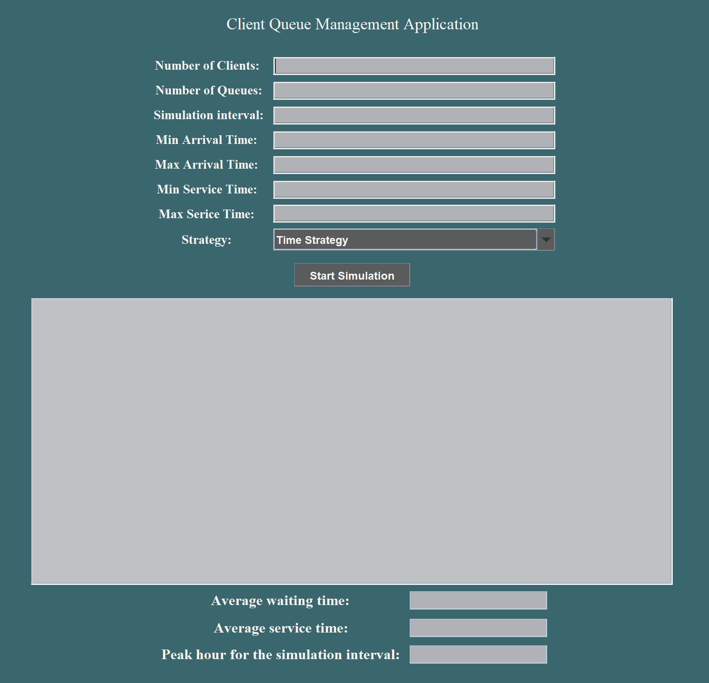

# Queue Management Application

A Java application that simulates client queueing systems and implements strategies to minimize waiting time.

  

    
  

## 🌟 Features

- Interactive GUI for parameter input
- Real-time queue visualization
- Multiple client distribution strategies
- Statistical results of simulation
- Log file generation

## 🛠️ Implementation

Built using Java with:
- Java Swing for GUI
- Thread management
- Strategy design pattern
- Synchronized methods
- Atomic variables for thread safety

## 📋 Input Parameters

- Number of clients (N)
- Number of queues (Q)
- Simulation interval
- Min/Max arrival time
- Min/Max service time
- Queue assignment strategy (Time or Shortest Queue)

## 🔍 Strategies

- **Time Strategy**: Assigns clients to queues with minimum waiting time
- **Shortest Queue Strategy**: Assigns clients to queues with fewest clients

## 📊 Results

The application displays:
- Real-time queue evolution
- Average waiting time
- Average service time
- Peak hour (time with maximum number of clients)

## 👨‍💻 Author

Maria-Magdalena Creț  
Technical University of Cluj-Napoca  
Faculty of Automation and Computer Science
